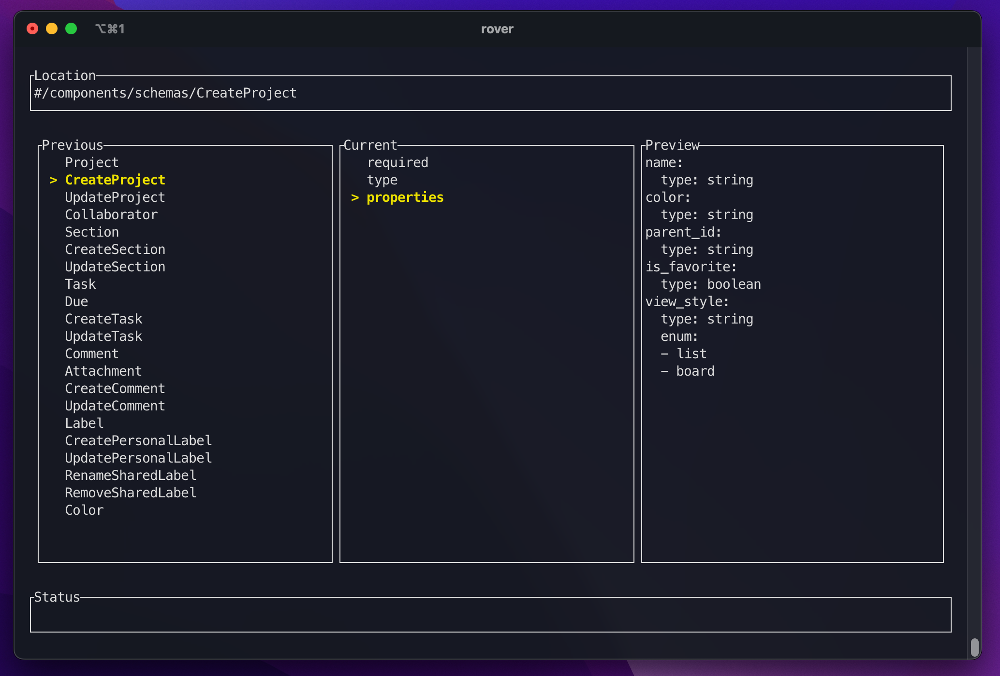

# Rover  

> The VIM-like "doc-walker"

Rover is a tool that simplifies the naviation of large JSON/YAML files (i.e. OpenAPI spec files) by allowing you to 
load a document and navigate the file by walking through the keys as if they were a file system like Finder in MacOS or Ranger. 

## Installing

< TODO > 

```
wget ...
```

### From Source

At the moment installation requires the [Cargo](https://doc.rust-lang.org/cargo/getting-started/installation.html) toolchain. 

```
cargo install --path . 
```

## Usage

In the terminal run the following command to open the file. Currently we support both JSON and YAML files.

```
rover ./any-file.yaml
```

This will start at TUI in the [Navigation View](#navigation-view). 

## Navigation View

< TODO: Make Gif >



### Location Section

Most of the implementation is based around the concepts of [JSON pointers](https://datatracker.ietf.org/doc/html/rfc6901). 
This section shows your current JSON path in the document (with a leading `#` to indicate the root of the document).

*Example:*

```
#/components/schemas/CreateProject
```

### Previous/Current 

In the "Current" pane, keys found at your current location (indicies for a list) are listed out. Only Maps and Lists are rendered in the 
Current/Previous sections. 

In the "Previous" pane, all the siblings of your current location are listed out similar to the "Current" pane. 

### Preview

The Preview pane shows what the document would look like if your current location was the root serialized in
the same format as the main document. For example, if you're currently in a YAML file then the preview 
will be serialized in YAML.

### Status bar

Any information related to an executed command will be shown here (Info, Warnings, Errors, etc.). Most 
updates should time out in 2 seconds but you can also manually clear them with `<Ctrl-c>`.

*Status messages:*

< TODO: add table here >

### Navigation Keybindings 

| Key | Description |
|:---|:----|

### Other Features

Reference Keys...

Editing...

## Search View

< TODO: Add Gif >

### Input 

The "input" section shows your current search query. The default search behavior is a "fuzzy" search
based on available JSON pointers like [fzf](https://github.com/junegunn/fzf).  

A similar syntax used in [fzf](https://github.com/junegunn/fzf#search-syntax) can be used here as well. 
By adding a prefix or suffix to your query you can alter the search behavior. Spaces are treated as a
"logical AND" and pipes (i.e. `|`) are used to represent "logical OR". Unlike normal boolean logic, to make 
search feel more natural `OR` actually has a higher natural precedence than `AND`. Prefixing a search query with 
`!` inverts there results and returns any items that don't match that query.

| Token | Match Type | Description | 
|:---|:---|:---|
| sbtrkt | fuzzy-match | JSON Pointers that match `sbtrkt` |
| 'path | exact-match | JSON Pointers that contain the substring `path` |
| ^#/info | prefix-match | JSON Pointers that start with `#/info` |
| operationId$ | exact-match | JSON Pointers that end with `operationId` |
| *description | deref-match | Dereferences the JSON pointer and matches only if `description` matches the Object keys of the children or string value of the value |

#### Example

A good example of using the extended syntax would be editing an OpenAPI spec and finding all paths that have an operationId contain the string `list` 

```
operationId$ *'list
```

### Current Selected

The "Current Selected" shows the currently selected search result (similar to the current pane in the navigation view)

### Paths

The "Paths" pane shows the current results of your search query.

### Preview 

Similar to the "Preview" in the "Navigation View", this shows a preview of what the document would look like if the 
currently selected search result was the root of the document.

### Search Keybindings

| Key | Description |
|:---|:----|

## Import

< TODO >

## Export

< TODO >

## Logging 

< TODO >

## Inspiration

This tool is inspired by VIM navigations and the [Ranger](https://github.com/ranger/ranger) file manager tool. 
